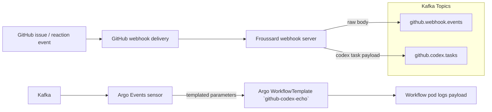

# Froussard GitHub Webhook Bridge

Froussard is a TypeScript function that receives GitHub webhook deliveries, verifies
signatures, and forwards structured payloads into Kafka for downstream automation such as
Argo Workflows.

## End-to-end Data Flow



## Runtime Responsibilities

- Validate GitHub `x-hub-signature-256` headers using `@octokit/webhooks`.
- Emit the original JSON event (`github.webhook.events`) and Codex task messages
  (`github.codex.tasks`) via Kafka.
- Surface health checks on `/health/liveness` and `/health/readiness`.

## Local Development

```bash
pnpm install
pnpm run build
pnpm run local
```

The local runtime exposes:

- `POST /webhooks/github` for GitHub event simulation.
- `/health/liveness` and `/health/readiness` for probes.

## Deployment Notes

- Environment configuration is provided via the ArgoCD `froussard` application.
- Kafka credentials are mounted from `kafka-codex-credentials` secrets.
- The Argo Events sensor in `argocd/applications/froussard/github-codex-echo-sensor.yaml`
  maps CloudEvent payloads into the `github-codex-echo` Workflow arguments.

## Verification Checklist

1. Create a GitHub issue in `gregkonush/lab` as the Codex trigger user.
2. Ensure Argo Events produces a Workflow named `github-codex-echo-*` in
   `argo-workflows` namespace.
3. Inspect pod logs to confirm the payload mirrors the Kafka message.
