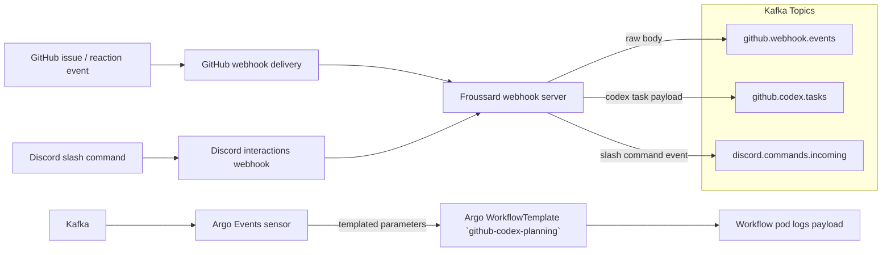

# Froussard Webhook Bridge

Froussard is a TypeScript function that receives webhook deliveries (GitHub issues/comments
and Discord slash commands), verifies signatures, and forwards structured payloads into Kafka
for downstream automation such as Argo Workflows and the Facteur service.

## End-to-end Data Flow



The Argo CD application also provisions the `discord.commands.incoming` Kafka topic so Discord automation can publish into the shared cluster alongside GitHub event streams.

## Runtime Responsibilities

- Validate GitHub `x-hub-signature-256` headers using `@octokit/webhooks`.
- Validate Discord `x-signature-ed25519`/`x-signature-timestamp` headers using `discord-interactions` before parsing the payload.
- Emit the original JSON event (`github.webhook.events`) and Codex task messages
  (`github.codex.tasks`) via Kafka.
- Normalize Discord slash command payloads (command name, options, interaction token, user metadata) and publish them into `discord.commands.incoming`.
- Provision and maintain the `discord.commands.incoming` Kafka topic for Facteur ingestion.
- Surface health checks on `/health/liveness` and `/health/readiness`.

## Local Development

```bash
pnpm install
pnpm run build
pnpm run local
```

The local runtime exposes:

- `POST /webhooks/github` for GitHub event simulation.
- `/health/liveness` and `/health/readiness` for probes.

## Deployment Notes

- Environment configuration is provided via the ArgoCD `froussard` application.
- Kafka credentials are mounted from `kafka-codex-credentials` secrets.
- The Argo Events sensor in `argocd/applications/froussard/github-codex-sensor.yaml`
  maps CloudEvent payloads into the `github-codex-planning` Workflow arguments.
- Discord slash command signature verification requires `DISCORD_PUBLIC_KEY`. Set
  `KAFKA_DISCORD_COMMAND_TOPIC` to control the output topic for normalized command events.

## Verification Checklist

1. Create a GitHub issue in `gregkonush/lab` as the Codex trigger user.
2. Ensure Argo Events produces a Workflow named `github-codex-planning-*` in
   `argo-workflows` namespace.
3. Inspect pod logs to confirm the payload mirrors the Kafka message.

## Codex Automation Image

The Codex planning/implementation workflows use a derived container built from
`apps/froussard/Dockerfile.codex`. The helper script below copies the local
Codex auth (`~/.codex/auth.json`), Codex configuration (`~/.codex/config.toml`),
and your GitHub CLI token into the image before pushing it to the shared
registry.

```bash
apps/froussard/src/codex/cli/build-codex-image.ts
```

- Override `IMAGE_TAG` to publish a different tag or registry.
- Provide `GH_TOKEN` explicitly if `gh auth token` is unavailable.
- The resulting image defaults to cloning `gregkonush/lab` into
  `/workspace/lab`; override `REPO_URL`, `BASE_BRANCH`, or `TARGET_DIR` at
  runtime as needed.
