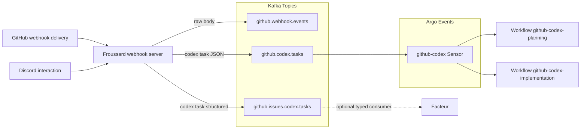

# Codex Issue Automation Workflow

This guide explains how the two-stage Codex automation pipeline works and how to verify it after deployment.

## Architecture

1. **Froussard** consumes GitHub webhooks. When `gregkonush` opens an issue it publishes a `planning` message to `github.codex.tasks` (and mirrors a structured copy to `github.issues.codex.tasks`). When the same user later comments `execute plan` on the issue it publishes an `implementation` message with the metadata Codex needs for the branch/PR handoff. Every delivery also lands on `github.webhook.events` for downstream auditing.
2. **Argo Events** (`github-codex` EventSource/Sensor) consumes those Kafka messages. The sensor now fans out to two workflow templates:
   - `github-codex-planning` for planning requests.
   - `github-codex-implementation` for approved plans.
   Argo Events remains pointed at the JSON stream (`github.codex.tasks`) because the Kafka EventSource only offers raw/JSON
   decoding today; the structured mirror exists for services that want to deserialize the protobuf payload directly.
3. Each **WorkflowTemplate** runs the Codex container (`gpt-5-codex` with `--reasoning high --search --mode yolo`):
   - `stage=planning`: `codex-plan.ts` (via the `github-codex-planning` template) generates a `<!-- codex:plan -->` issue comment and logs its GH CLI output to `.codex-plan-output.md`.
   - `stage=implementation`: `codex-implement.ts` executes the approved plan, pushes the feature branch, opens a **draft** PR, maintains the `<!-- codex:progress -->` comment via `codex-progress-comment.ts`, and records the full interaction in `.codex-implementation.log` (uploaded as an Argo artifact).
   - Both templates carry a `codex.stage` label so downstream sensors can reference the stage without parsing the workflow name.



Run `facteur codex-listen --config <path>` to stream the structured payloads while you build consumers; the command uses the
`github.issues.codex.tasks` topic and simply echoes the decoded `github.v1.CodexTask` message.

Prod deployments mirror that behaviour via Knative Eventing: `kubernetes/facteur/base/codex-kafkasource.yaml` feeds
`github.issues.codex.tasks` into the Factor service (`POST /codex/tasks`), where the handler logs the stage, repository,
issue number, and delivery identifier for observability.
## Prerequisites

- Secrets `github-token` and `codex-openai` in `argo-workflows` namespace.
- Discord secrets regenerated in `argocd/applications/froussard/discord-secrets.yaml` (provides both `discord-bot` and `discord-codex-bot` sealed manifests).
- Kafka topics `github.webhook.events`, `github.codex.tasks`, and `github.issues.codex.tasks` deployed via Strimzi.
- Argo Events resources under `argocd/applications/froussard/` synced.

## Manual End-to-End Test

### Discord Relay Integration

Codex now mirrors planning and implementation output into a per-run Discord channel when the bot credentials are present.

1. **Provision the secret**
   - Run `pnpm run froussard:reseal` (requires `op`, `kubectl`, and `kubeseal`) to refresh `argocd/applications/froussard/discord-secrets.yaml` with sealed values for `bot-token`, `guild-id`, and optionally `category-id`.
   - Argo CD reconciles the sealed secret into an opaque secret named `discord-codex-bot` in `argo-workflows`.
2. **Verify workflow envs**
   - Both `github-codex-planning` and `github-codex-implementation` templates now inject `DISCORD_BOT_TOKEN`, `DISCORD_GUILD_ID`, and `DISCORD_CATEGORY_ID` into the Codex container. The relay only activates when the token and guild id are present.
3. **Dry-run locally**
   - Exercise the relay without touching Discord by piping sample output:
     ```bash
     printf 'hello discord\nthis is a dry run\n' | \
       bunx tsx apps/froussard/scripts/discord-relay.ts \
         --stage planning \
         --repo proompteng/lab \
         --issue 999 \
         --run-id local-test \
         --dry-run
     ```
   - Expect stderr to show the fabricated channel name, metadata banner, and echoed log lines.
4. **End-to-end smoke check**
   - Trigger the planning workflow and confirm a new Discord channel appears under the configured category with the Codex transcript streaming live. Implementation runs reuse the same secret and stage metadata but post into their own channels.

### Implementation Progress Comment Lifecycle

- Codex owns a single issue comment anchored by `<!-- codex:progress -->`; the helper at `apps/froussard/src/codex/cli/codex-progress-comment.ts` keeps it consistent.
- On implementation kickoff the helper seeds a checklist from the approved plan, marks the active step, and appends a short status section (tests run, blockers, next action).
- After every meaningful milestone the comment is updated in-place so reviewers can follow along without reading the Argo logs.
- When work finishes, the checklist is fully checked, the transient status block is replaced with the final summary/validation notes, and the same comment becomes the permanent implementation recap.
- Provide the comment body via stdin or `--body-file`; set `ISSUE_REPO`, `ISSUE_NUMBER`, and (optionally) `CODEX_PROGRESS_COMMENT_MARKER`/`CODEX_PROGRESS_COMMENT_LOG_PATH` before invoking the helper.
- Use `--dry-run` when validating changes locally—this prints the resolved body/action without mutating GitHub.

1. **Create a test issue** in `proompteng/lab` (while logged in as `gregkonush`).
   - Check `argo get @latest -n argo-workflows` to see the planning workflow run via `github-codex-planning`.
   - Confirm the issue received a comment beginning with `<!-- codex:plan -->` that follows the Summary/Steps/Validation/Risks/Handoff Notes template.
2. **Approve the plan** by replying `execute plan` on the issue (as `gregkonush`).
   - Watch for a new workflow named `github-codex-implementation-*`; it should push a branch ( `codex/issue-<number>-*` ), open a draft PR, and upload `.codex-implementation.log` as an artifact.
   - Confirm a single progress comment remains on the issue, anchored by `<!-- codex:progress -->`, with the checklist reflecting the plan and validation state.
   - The issue gains a follow-up comment linking to the PR.

## Helpful Commands

- Inspect workflows:
  ```bash
  argo list -n argo-workflows
  argo get <workflow-name> -n argo-workflows
  argo logs <workflow-name> -n argo-workflows
  ```
- Peek at Kafka traffic:
  ```bash
  kubectl -n kafka run kafka-cli --rm -it --image=strimzi/kafka:0.47.0-kafka-3.7.0 -- /bin/bash
  bin/kafka-console-consumer.sh --bootstrap-server kafka-kafka-bootstrap:9092 \
    --topic github.codex.tasks --from-beginning
  ```

## Direct Workflow Smoke Tests

Submit the template manually to isolate execution from GitHub/Kafka:

```bash
argo submit --from workflowtemplate/github-codex-planning -n argo-workflows \
  -p rawEvent='{}' \
  -p eventBody='{"stage":"planning","prompt":"Dry run","repository":"proompteng/lab","issueNumber":999,"base":"main","head":"codex/test","issueUrl":"https://github.com/proompteng/lab/issues/999","issueTitle":"Codex dry run","issueBody":"Testing orchestration"}'
```

Trigger the implementation flow directly when you have an approved plan payload handy:

```bash
argo submit --from workflowtemplate/github-codex-implementation -n argo-workflows \
  -p rawEvent='{}' \
  -p eventBody='{"stage":"implementation","prompt":"<codex prompt>","repository":"proompteng/lab","issueNumber":999,"base":"main","head":"codex/test","issueUrl":"https://github.com/proompteng/lab/issues/999","issueTitle":"Codex dry run","issueBody":"Testing orchestration","planCommentBody":"<!-- codex:plan -->\n..."}'
```

The implementation workflow writes verbose output to `/workspace/lab/.codex-implementation.log`; inspect the artifact in Argo if you need the full Codex transcript.

## Manifest & CI Safety Checks

Whenever you introduce a new Codex workflow or touch the surrounding manifests, run the validation scripts locally before opening a PR:

- `pnpm --filter froussard run test`
- `scripts/argo-lint.sh` (offline Argo lint of any Workflow/WorkflowTemplate YAML)
- `scripts/kubeconform.sh argocd` (kubeconform with custom CRD schemas)

Both lint scripts are what CI uses, so matching their output locally keeps Argo CD syncs clean.

## Troubleshooting

- **No plan comment**: verify the webhook secret/names.
- **Workflows not triggered**: check the `github-codex` sensor/eventsource pods.
- **Draft PR missing**: confirm the GitHub token has `repo` scope and the workflow pod can push.
