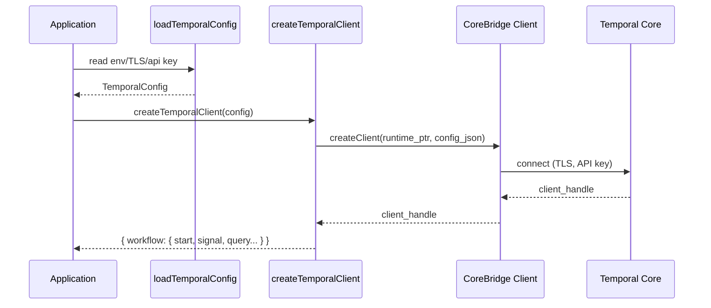

# Client Runtime Rewrite Guide

**Objective:** Implement a Bun-native Temporal client that communicates via the new FFI bridge and exposes parity with the Node SDK’s `WorkflowClient`.

---

## 1. Public API Target

`createTemporalClient` should return:

```ts
interface TemporalClient {
  workflow: {
    start(request: StartOptions): Promise<StartWorkflowResult>
    signal(handle: WorkflowHandle, signalName: string, ...args: unknown[]): Promise<void>
    query(handle: WorkflowHandle, queryName: string, ...args: unknown[]): Promise<unknown>
    terminate(handle: WorkflowHandle, options?: TerminateOptions): Promise<void>
  }
  connection: { close(): Promise<void> }
  namespace: string
}
```

Workflows handles must track:

```ts
interface StartWorkflowResult {
  workflowId: string
  runId: string
  namespace: string
  firstExecutionRunId?: string
  handle: WorkflowHandle
}

interface WorkflowHandle {
  workflowId: string
  runId?: string
  firstExecutionRunId?: string
  namespace: string
}
```

---

## 2. Configuration Handling



`loadTemporalConfig` already provides host, port, TLS, API key, namespace. Extend to surface:

- gRPC metadata overrides
- identity, client name/version
- retry settings

Feed these into `core-bridge` client creation request.

---

## 3. Request Serialization

Create helper module `src/client/serialization.ts`:

- `buildStartWorkflowRequest(options, payloadCodec)` -> `Buffer`
- `buildSignalRequest(handle, signal, args)`
- `buildQueryRequest(handle, query, args)`
- `buildTerminateRequest(handle, reason, details)`

Encoding steps:

1. Convert JS args into Temporal payloads (use `payloads-codec`).
2. Pack envelope structure described in `ffi-surface.md`.
3. Serialize to JSON, then `Buffer.from(..., 'utf8')`.
4. Pass pointer/length to FFI.

Responses should be decoded accordingly.

---

## 4. Retry & Error Semantics

- Map FFI error strings to rich errors with `.cause`, `.code`, `.status` (gRPC status if present).
- Implement retryable metadata so callers can decide to retry manual commands.
- Provide optional exponential backoff helper for `start` and `signal` operations (mirroring upstream).

---

## 5. Testing

Refer to `testing-plan.md`:

- Unit: stub FFI to return deterministic buffers, assert payload encodings.
- Integration: run local Temporal, execute `helloTemporal` workflow via client, query/signal/terminate.
- TLS scenario: use self-signed certs to ensure config passes through.

---

## 6. Completion Checklist

- [ ] `src/client.ts` removes `@temporalio/client` import.
- [ ] `src/client/index.ts` no longer re-exports vendor package.
- [ ] CLI example uses new client for manual testing.
- [ ] README updated with limitations (if any).
- [ ] Added regression tests for starvation, start-idempotency, and signal-with-start.

Once complete, remove any residual dependencies on the upstream client package from `package.json`.
