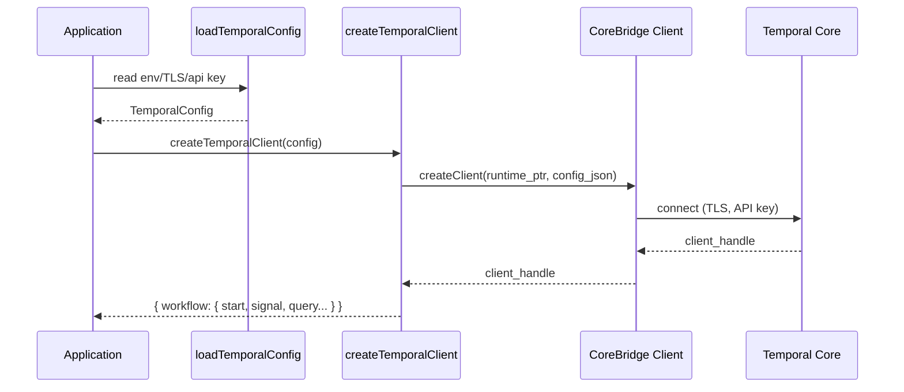

# Client Runtime Rewrite Guide

**Objective:** Implement a Bun-native Temporal client that communicates via the new FFI bridge and exposes parity with the Node SDK’s `WorkflowClient`.

---

## 1. Public API Target

`createTemporalClient` currently returns the Bun-native runtime/client bundle:

```ts
interface TemporalClientInstance {
  runtime: TemporalRuntime
  client: TemporalCoreClient
  config: TemporalConfig
  shutdown: () => Promise<void>
}

class TemporalCoreClient {
  namespace: string
  identity: string

  describeNamespace(namespace?: string): Promise<Record<string, unknown>>
  startWorkflow(options: StartWorkflowOptions): Promise<{ runId: string; workflowId: string; namespace: string }>
  signalWorkflow(options: SignalWorkflowOptions): Promise<SignalWorkflowResult>
  // TODO: queryWorkflow, terminateWorkflow, cancelWorkflow
}
```

---

## 2. Configuration Handling



`loadTemporalConfig` already provides host, port, TLS, API key, namespace. Extend to surface:

- gRPC metadata overrides
- identity, client name/version
- retry settings

Feed these into `core-bridge` client creation request.

---

## 3. Request Serialization

Start/signal serialization currently lives inline in `TemporalCoreClient`, encoding arguments as `json/plain` payloads before forwarding to the bridge. Once query/terminate land, extract reusable helpers to keep payload handling consistent across commands.

---

## 4. Retry & Error Semantics

- Map FFI error strings to rich errors with `.cause`, `.code`, `.status` (gRPC status if present).
- Implement retryable metadata so callers can decide to retry manual commands.
- Provide optional exponential backoff helper for `start` and `signal` operations (mirroring upstream).

---

## 5. Testing

Refer to `testing-plan.md`:

- Unit: stub FFI to return deterministic buffers, assert payload encodings.
- Integration: run local Temporal, execute `helloTemporal` workflow via client, query/signal/terminate.
- TLS scenario: use self-signed certs to ensure config passes through.

---

## 6. Completion Checklist

- [x] `src/client.ts` removes `@temporalio/client` import.
- [x] `src/client/index.ts` no longer re-exports vendor package.
- [ ] CLI example uses new client for manual testing.
- [x] README updated with limitations (if any).
- [ ] Added regression tests for starvation, start-idempotency, and signal-with-start.

Once complete, remove any residual dependencies on the upstream client package from `package.json`.
