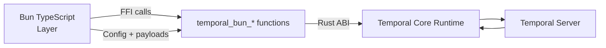

# Temporal Bun SDK — Native FFI Surface Blueprint

**Audience:** Future Codex instances shipping the Bun-native Temporal SDK  
**Status:** Authoritative blueprint (17 Oct 2025)  
**Goal:** Deliver a complete Bun ↔ Temporal Core bridge so no upstream `@temporalio/*` packages are required.

---

## 1. Scope & Principles

| Principle | Description |
|-----------|-------------|
| Parity-first | Expose enough surface area to run workers, workflows, and activities exactly like the Node SDK. |
| Bun-native ergonomics | Offer small, typed helpers on the TypeScript side; keep unsafe FFI isolated to `src/internal/core-bridge/native.ts`. |
| Crash resilience | All exported functions must guard null pointers, return deterministic errors via `temporal_bun_error_message`, and never panic. |
| Testable contracts | Every FFI export gets a dedicated Bun test (unit) plus integration coverage via docker-compose Temporal stack. |



---

## 2. Function Matrix

Current progress snapshot:

- ✅ Client connect + describe namespace working (Bun integration tests exercise live Temporal).
- ⚙️ Next up: add workflow operations (start/signal/query/terminate) in both Rust and TS layers.
- ⬜️ Worker and runtime APIs remain untouched.

| Area | Rust Export | Purpose | TS Wrapper | Status |
|------|-------------|---------|------------|--------|
| Runtime | `temporal_bun_runtime_new(options_ptr, len)` | Create `CoreRuntime` with telemetry/logging config | `native.createRuntime` (extend options) | ✅ (options ignored today) |
| Runtime | `temporal_bun_runtime_free(runtime_ptr)` | Release runtime | `native.runtimeShutdown` | ✅ |
| Runtime | `temporal_bun_runtime_update_telemetry(runtime_ptr, options_ptr, len)` | Apply telemetry exporters (Prom, OTLP) | `coreBridge.configureTelemetry` | ⬜️ TODO |
| Runtime | `temporal_bun_runtime_set_logger(runtime_ptr, callback_ptr)` | Forward core logs into Bun | `coreBridge.installLogger` | ⬜️ TODO |
| Client | `temporal_bun_client_connect_async(runtime_ptr, config_ptr, len)` | Create gRPC retry client + namespace | `native.createClient` | ✅ (async pending handle) |
| Client | `temporal_bun_client_free(client_ptr)` | Dispose client | `native.clientShutdown` | ✅ |
| Client | `temporal_bun_client_describe_namespace_async(client_ptr, payload_ptr, len)` | Describe namespace via async pending handle | `native.describeNamespace` | ✅ (new) |
| Client | `temporal_bun_client_update_headers(client_ptr, headers_ptr, len)` | Update gRPC metadata (API key, custom headers) | `coreBridge.client.updateHeaders` | ⬜️ TODO |
| Client | `temporal_bun_client_start_workflow(client_ptr, payload_ptr, len)` | Start workflow execution | `client.workflow.start` | ✅ Implemented |
| Client | `temporal_bun_client_signal(client_ptr, payload_ptr, len)` | Send signal to existing workflow | `client.signal` | ⬜️ TODO |
| Client | `temporal_bun_client_query(client_ptr, payload_ptr, len)` | Run workflow query | `client.query` | ⬜️ TODO |
| Client | `temporal_bun_client_terminate_workflow(...)` | Terminate workflow | `client.terminate` | ⬜️ TODO |
| Client | `temporal_bun_client_cancel_workflow(...)` | Cancel workflow | `client.cancel` | ⬜️ TODO |
| Client | `temporal_bun_client_signal_with_start(...)` | Signal-with-start helper | `client.signalWithStart` | ⬜️ TODO |
| Byte transport | `temporal_bun_byte_array_new(ptr, len)` | Allocate vector for responses | `byteArray.fromBuffer` | ⬜️ TODO |
| Byte transport | `temporal_bun_byte_array_free(array_ptr)` | Free allocated data | `native.freeByteArray` | ✅ |
| Pending | `temporal_bun_pending_client_poll(pending_ptr)` | Readiness check for client connect (0=pending,1=ready,-1=error) | `pendingClient.poll` | ✅ (new) |
| Pending | `temporal_bun_pending_client_consume(pending_ptr)` | Consume pending client handle | `pendingClient.consume` | ✅ (new) |
| Pending | `temporal_bun_pending_client_free(pending_ptr)` | Drop pending client handle | `pendingClient.destroy` | ✅ (new) |
| Pending | `temporal_bun_pending_byte_array_poll(pending_ptr)` | Non-blocking readiness check (0=pending,1=ready,-1=error) | `pending.poll` | ✅ (new) |
| Pending | `temporal_bun_pending_byte_array_consume(pending_ptr)` | Consume ready result into ByteArray | `pending.consume` | ✅ (new) |
| Pending | `temporal_bun_pending_byte_array_free(pending_ptr)` | Drop pending handle (cleanup) | `pending.destroy` | ✅ (new) |

### Async Pending Handles

- Pending handles wrap Tokio futures in a background thread, surface `poll` + `consume` semantics to Bun, and ensure the JS event loop never blocks on gRPC calls.
- Every async FFI export must return a pending handle (or reuse the shared helpers) so we can apply the same lifecycle guarantees: single-consume, deterministic error propagation via `temporal_bun_error_message`, and explicit `free`.
- The Bun side polls on an interval (`setTimeout` cadence) and calls `consume` only once `poll` reports ready. Errors surface immediately via the shared error buffer, and the handle is freed regardless of success or failure.

| Worker | `temporal_bun_worker_new(runtime_ptr, client_ptr, config_ptr, len)` | Instantiate worker for task queue | `native.createWorker` | ⬜️ TODO |
| Worker | `temporal_bun_worker_free(worker_ptr)` | Free worker | `native.workerShutdown` | ⬜️ TODO |
| Worker | `temporal_bun_worker_poll_workflow_task(worker_ptr)` | Poll workflow tasks (blocking) | `workerBridge.pollWorkflowTask` | ⬜️ TODO |
| Worker | `temporal_bun_worker_complete_workflow_task(worker_ptr, payload_ptr, len)` | Complete workflow task | `workerBridge.completeWorkflowTask` | ⬜️ TODO |
| Worker | `temporal_bun_worker_poll_activity_task(worker_ptr)` | Poll activity task | `workerBridge.pollActivityTask` | ⬜️ TODO |
| Worker | `temporal_bun_worker_complete_activity_task(worker_ptr, payload_ptr, len)` | Respond to activity task | `workerBridge.completeActivityTask` | ⬜️ TODO |
| Worker | `temporal_bun_worker_record_activity_heartbeat(worker_ptr, payload_ptr, len)` | Activity heartbeat | `workerBridge.recordHeartbeat` | ⬜️ TODO |
| Worker | `temporal_bun_worker_initiate_shutdown(worker_ptr)` | Soft shutdown (no new polls) | `worker.shutdown` | ⬜️ TODO |
| Worker | `temporal_bun_worker_finalize_shutdown(worker_ptr)` | Wait for inflight tasks | `worker.runUntilShutdown` | ⬜️ TODO |
| Ephemeral | `temporal_bun_test_server_start(config_ptr, len)` | Optional local test server | `testServer.start` | ⬜️ OPTIONAL |
| Ephemeral | `temporal_bun_test_server_stop(server_ptr)` | Stop test server | `testServer.stop` | ⬜️ OPTIONAL |

> **Implementation note:** The worker-related FFI functions mirror `temporal-sdk-core`’s `CoreSDK` interface. Use the existing `temporal-sdk-core-c-bridge` as a reference for payload shapes.

---

## 3. Payload & Encoding Contracts

1. **JSON control envelopes**  
   All FFI calls accept a JSON envelope describing the action. Example for `temporal_bun_client_start_workflow`:
   ```json
   {
     "namespace": "default",
     "taskQueue": "prix",
     "workflowId": "helloTemporal-123",
     "workflowType": "helloTemporal",
     "arguments": [ /* payloads encoded as base64 */ ],
     "timeoutMs": 60000
   }
   ```
   The TS helper handles encoding Temporal payloads (proto) to buffers, then wraps them in the envelope.

2. **Payload bytes**  
   For responses or streaming items, return `ByteArray` pointers. The TS side converts them into `ArrayBuffer` -> `Buffer` -> strongly typed objects.

3. **TLS / Metadata**  
   Extend `ClientConfig` to include TLS PEM strings (base64) or file paths resolved in TS. Rust side configures `ClientOptionsBuilder` accordingly.

4. **Error propagation**  
   Any failure: return `null` pointer or `0` and call `error::set_error`. Message template: `"bridge:<component>: <summary>: <details>"`. TS wrapper throws enriched `TemporalBridgeError`.

---

## 4. TypeScript Layer Tasks

| Module | Responsibilities |
|--------|------------------|
| `src/internal/core-bridge/native.ts` | Map each FFI export, handle pointer lifetimes (`ptr`, `toArrayBuffer`), normalize errors. |
| `src/core-bridge/index.ts` | Provide a Bun-friendly CoreSDK wrapper replicating `@temporalio/core-bridge` shape (runtime, worker, client). |
| `src/client.ts` | Replace direct `@temporalio/client` usage with Core bridge client commands and high-level helpers (`startWorkflow`, `signal`, etc.). |
| `src/worker.ts` | Implement polling loop, workflow isolate management (use Bun’s `import()` for workflows), activity execution, heartbeats, shutdown logic. |
| `src/workflow/runtime` | Introduce a minimal workflow runtime (activation handling, patch markers, timer/signal commands). Consider porting upstream workflow isolate logic. |
| `src/common/payloads.ts` | Serialize/deserialize Temporal payloads (proto via `@temporalio/proto` vendored TypeScript, or implement own). |

---

## 5. Testing Strategy

1. **Unit Tests (Bun)**
   - `tests/native-runtime.test.ts`: runtime creation, telemetry setter, logger callback invoked.
   - `tests/native-client.test.ts`: start/signal/query with mocked core (use `tokio::test` harness or stub responses).
   - `tests/native-worker.test.ts`: ensure poll/complete functions handle JSON + payloads correctly (use fake core responses).

2. **Integration Tests**
   - Docker Compose launching Temporal server + Bun worker (already in repo). Write tests that:
     - Start workflow -> activity executes -> worker completes.
     - Activity heartbeat/resume.
     - Workflow signal & query.
     - Graceful shutdown after `SIGTERM`.

3. **Determinism / Replay**
   - Capture activation history from a run and replay using the workflow runtime to ensure deterministic result.

4. **Telemetry / Logging Smoke**
   - Config baseline: Prometheus listener + log forwarding to Bun (assert callbacks fired).

---

## 6. Migration Plan (Stepwise)

1. **Phase 1 — Client Parity**
   - Implement TLS/API key support, start/signal/query/terminate FFI.
   - Rewrite `createTemporalClient` to rely solely on FFI. Remove `@temporalio/client` dependency.

2. **Phase 2 — Worker Core**
   - Implement worker create/poll/complete/heartbeat in Rust & TS.
   - Port minimal workflow runtime (activation dispatch, activity scheduling). Remove `@temporalio/worker`.
   - Provide `bun run dev` sample that completes activities against real Temporal.

3. **Phase 3 — Workflow Runtime Enhancements**
   - Add memo, search attributes, patch APIs, local activities, continue-as-new.
   - Support bundling (Bun loader) or dynamic import for workflow code.

4. **Phase 4 — Tooling & Docs**
   - Update README, CLI templates to reflect pure Bun stack.
   - Publish FFI docs (this file) and implementation status tracker.

5. **Phase 5 — Validation**
   - CI job building native bridge for macOS/Linux, running integration suite.
   - Publish canary build to npm (internal tag) for manual QA before public release.

---

## 7. Reference Materials

- Temporal Core Rust docs: `<repo>/vendor/sdk-core/core/src/lib.rs`
- Temporal C bridge (for parity): `<repo>/vendor/sdk-core/sdk-core/src/lib.rs` + `temporal-sdk-core-c-bridge`
- Current minimal bridge: `packages/temporal-bun-sdk/native/temporal-bun-bridge/src/lib.rs`
- Bun FFI reference: https://bun.sh/docs/api/ffi

---

## 8. Open Questions

1. **Workflow isolate:** Do we embed JavaScriptCore via Bun, or spawn separate Bun processes per workflow task? Evaluate determinism guarantees.
2. **Payload codec:** Should we vendor Temporal proto definitions or implement JSON payloads only for first release?
3. **Telemetry defaults:** What exporters should be built-in vs. optional features behind cargo flags?
4. **Windows support:** Out of scope right now; document if anything should explicitly guard against it.

Document updates should append sections rather than overwrite to keep audit history for future iterations.
