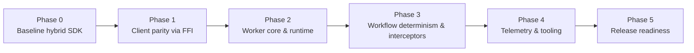

# Migration Phases & Milestones

**Purpose:** Track the staged rollout from the current hybrid SDK to a fully Bun-native Temporal SDK.

---

## Phase 0 — Baseline (Current)

- Minimal FFI (runtime + client connect).
- TypeScript layer re-exports upstream packages.
- CLI scaffolding available, but workers rely on `@temporalio/worker`.
- Example project uses workspace link but still depends on upstream packages.

**Exit Criteria:** FFI blueprint, module-specific plans (this doc set) complete. ✅

---

## Phase 1 — Client Parity

- Implement FFI for client operations (start, signal, query, terminate, headers, TLS).
- Rewrite `src/client.ts` to use new Core bridge client.
- ✅ `start_workflow` wired through Rust bridge + Bun client (`createTemporalClient.workflow.start`).
- Remove `@temporalio/client` dependency.
- Add unit + integration tests for client operations.

**Deliverables:**
- Passing tests (`client` suites).
- Docs/README updated.
- Example project uses new client for workflow start/query.

---

## Phase 2 — Worker Core

- FFI for worker poll/complete/heartbeat/shutdown.
- Implement new worker runtime loops.
- Build minimal workflow runtime to process activations.
- Replace `@temporalio/worker` dependency.
- CLI worker runs successfully against local Temporal server.

**Milestones:**
- Unit tests for worker loops.
- Integration tests for simple workflow execution.
- Document limitations (no local activities, etc. if deferred).

---

## Phase 3 — Workflow Runtime Parity

- Support deterministic features (patch markers, continue-as-new, child workflows).
- Implement interceptor pipeline.
- Provide payload codec extensibility (JSON + optional binary).
- Add determinism replay harness.

**Success Metrics:**
- Replay tests green.
- Sample workflows from upstream examples run without code changes.

---

## Phase 4 — Ecosystem Integration

- Telemetry exports (Prometheus, OTLP).
- Metrics/logging callbacks wired into runtime.
- CLI and Docker templates updated to use native stack only.
- Documentation and tutorials refreshed.

**Optional:** Provide pre-built native binaries for macOS/Linux to streamline installs.

---

## Phase 5 — Release Readiness

- CI lanes stable on macOS/Linux (unit + integration).
- Publish RC build to npm (`0.1.0-rc.1`).
- Manual QA across local Temporal + Temporal Cloud.
- Collect feedback, address bugs, finalize stable release.

---

## Tracking & Ownership

- Maintain a checklist in GitHub Projects (one column per phase).
- Each phase should have an owner, deadlines, and link to PRs.
- Update `design-e2e.md` summary as phases complete.
