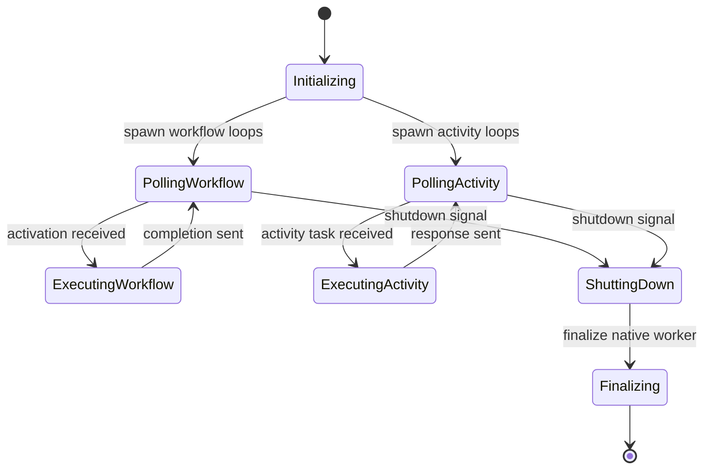

# Worker Runtime Implementation Guide

**Purpose:** Stand up a Bun-native worker capable of polling, executing, and responding to Temporal tasks without relying on `@temporalio/worker`.

---

## 1. Architecture Overview

```
createWorker(options)
  ├─ WorkerRuntime (manages lifecycle)
  │   ├─ WorkflowTaskLoop (poll/dispatch)
  │   ├─ ActivityTaskLoop (poll/dispatch)
  │   ├─ ShutdownController
  │   └─ MetricsEmitter / Logger hooks
  └─ Workflow Isolate Manager (per-workflow execution context)
```

---



---

## 2. Responsibilities

| Component | Description |
|-----------|-------------|
| `WorkerRuntime` | Owns native worker handle, spawns poll loops, orchestrates shutdown, exposes `run()` and `shutdown()` methods. |
| `WorkflowTaskLoop` | Async loop calling `native.worker.pollWorkflowTask`, passing activations to workflow runtime, sending completions. |
| `ActivityTaskLoop` | Async loop polling activities, running registered activity functions, returning results or failures. |
| `WorkflowIsolateManager` | Loads workflow bundles, maintains deterministic execution per run, handles patch markers, timers, signals. |
| `InterceptorManager` | Optional; plug-in architecture for inbound/outbound interceptors (logging, tracing). |

---

## 3. Execution Flow

1. **Initialization**
   - Resolve `workflowsPath` to compiled JS or raw TS (Bun can transpile).
   - Register activity implementations (object or map).
   - Create native worker via FFI using runtime/client handles.

2. **Running**
   - `run()` kicks off:
     - `workflowLoop()` with configurable concurrency.
     - `activityLoop()` likewise.
   - Use `AbortController` to propagate shutdown signals.

3. **Task Handling**
   - **Workflow tasks:** 
     - Decode activation.
     - Load workflow isolate if new run (module cache keyed by workflow id + run id).
     - Execute activation via workflow runtime API.
     - Encode completion commands and send through FFI.
   - **Activity tasks:**
     - Lookup implementation by name.
     - Execute with timeout enforcement (setTimeout + Promise.race).
     - Heartbeats triggered via `worker.recordActivityHeartbeat`.
     - Respond success/failure via FFI.

4. **Shutdown**
   - `shutdown(gracefulTimeoutMs)`:
     - Stop new polls (call `worker_initiate_shutdown`).
     - Wait for loops to settle.
     - After timeout, force cancel outstanding loops.
     - Call `worker_finalize_shutdown`.

---

## 4. Implementation Tasks

1. **Native bindings** (needs FFI support as per `ffi-surface.md`).
2. **Task loop utilities**  
   Create `createPollingLoop({ poll, handler, onError })` to share logic between workflow/activity loops.
3. **Workflow loader**  
   - Use dynamic import with query string to avoid cache collisions (`import(`${workflowsPath}?workflow=${workflowType}`)`).
   - Ensure `Bun.Transpiler` used if workflows shipped as TS.
4. **Activity registry**  
   - Accept object or array. Normalize to `Map<string, ActivityFn>`.
   - Validate on startup (throw if missing).
5. **Metrics/logging**  
   - Provide hooks for task counts, latencies (expose minimal API).
   - Later integrate with telemetry runtime.
6. **Error handling**  
   - Convert thrown errors to Temporal failure payloads (message + stack).
   - Preserve application-specific failure types with optional metadata.

---

## 5. Testing Requirements

Refer to `testing-plan.md` for full matrix. Highlights:

- Unit tests for polling loop restart/retry logic.
- Activity timeout + heartbeat cases.
- Workflow continue-as-new and timer scheduling.
- Shutdown behavior (graceful vs immediate).
- Integration test executing sample workflow end-to-end.

---

## 6. Deliverables

- `src/worker.ts` rewritten to use new runtime classes.
- `src/worker/index.ts` exports updated API (remove vendor re-export).
- CLI sample (`temporal-bun-worker`) builds/runs with new worker.
- Example project (`temporal-bun-sdk-example`) functions without upstream dependency.

Keep this guide updated as worker features evolve (local activities, patch markers, etc.).
